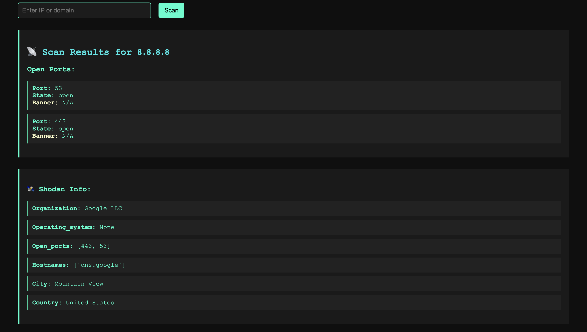

# 🛡️ CyberGuard – Lightweight Security Scanner

CyberGuard is a beginner-friendly cybersecurity tool built with Python that scans IP addresses or domains for open ports, grabs service banners, checks Shodan exposure, and generates both text and HTML reports. It includes both a **command-line interface (CLI)** and a modern **Flask web app UI**.

---

## 🌟 Features

- 🔍 Scans for open ports using `nmap`
- 🧠 Grabs banner information from each open port
- 🌐 Integrates with the Shodan API to check for public exposure
- 📄 Generates plain text and HTML scan reports
- 🖥️ Includes a beautiful Flask-based web interface

---

## 🚀 How to Use (CLI)

1. Install dependencies:

pip install python-nmap shodan jinja2

2. Run the scanner:

python main.py


3. Enter an IP or domain when prompted (example: `8.8.8.8`)

4. View the results in the terminal and find:
   - `8.8.8.8_report.txt`
   - `8.8.8.8_report.html`

---

## 🌐 Web Version (Flask UI)

CyberGuard also includes a fully functional Flask web interface:

### ▶️ Run the Web App

python web-version/app.py


Then visit [http://127.0.0.1:5000] in your browser to scan targets.

### 🖼️ CyberGuard Web UI



---

## 📦 Requirements

- Python 3.10+
- Modules:
  - `python-nmap`
  - `shodan`
  - `jinja2`
  - `flask`

---

## 📁 Project Structure

```
CyberGuard/
├── main.py                  # CLI entry point
├── scanner.py               # Port scanning and banner grabbing
├── report.py                # Report generation (txt & html)
├── utils.py                 # IP/domain validation
├── shodan_lookup.py         # Shodan API integration
├── template.html            # HTML report template
├── web-version/
│   ├── app.py               # Flask app
│   ├── templates/
│   │   └── index.html       # Web UI template
│   └── [reports]
├── assets/
│   └── cyberguard_ui.png    # Screenshot for README
```

---

## 💡 Made By

**Sai Toshit Raj Repala**  
Student, Developer, Future Cybersecurity Analyst 💻  
[GitHub @ToshitDev](https://github.com/ToshitDev)

---

## 📜 License

This project is for educational and personal use only.